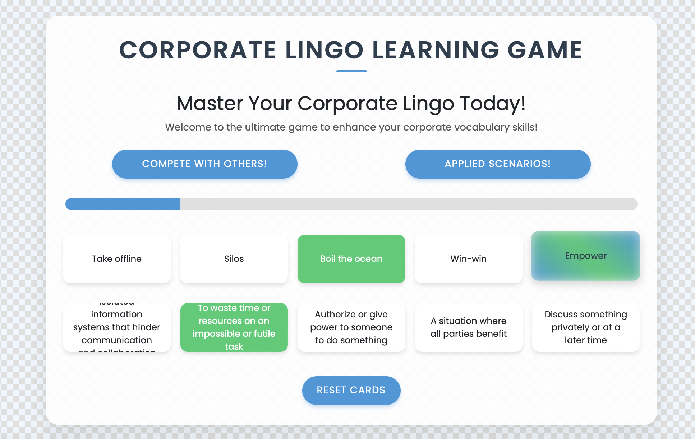
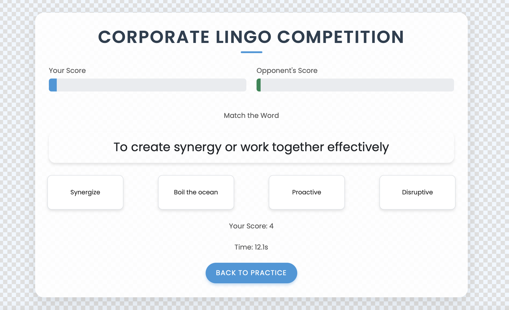
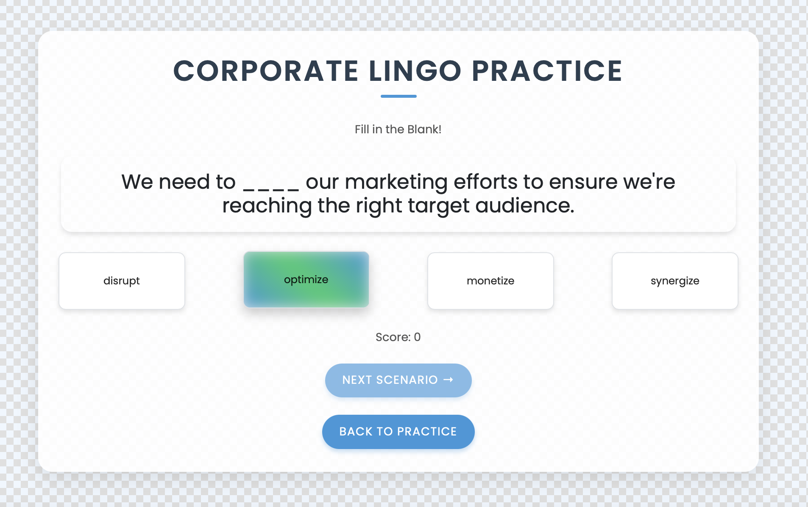

# Corpo-Lingo: Master Corporate Lingo

Learn Corporate Lingo to get Employed!!!

## Summary

Ever felt lost in a sea of corporate jargon? Fear not! This project will turn you into a corporate lingo master, ready to impress in any boardroom.

## Features

1. **Learn Corporate Lingo:**
   Match words with their definitions to build your corporate vocabulary. This feature helps you understand and remember key terms used in the corporate world.



2. **Real-Time Competition:**
   Compete with other players in real-time to see who can match definitions the fastest. This adds a fun and competitive element to your learning process.



3. **Practice in Real-Life Scenarios:**
   Apply the words you've learned in simulated real-life corporate scenarios. This feature helps you practice and reinforce your new vocabulary in a practical context.



## How to Run

1. **Clone the repo:**

   ```sh
   git clone https://github.com/surpeme-gg-gg/corpo-lingo.git
   cd corpo-lingo
   ```

2. **Install dependencies:**

   ```sh
   npm install
   ```

3. **Run the app:**
   ```sh
   node server.js
   ```
