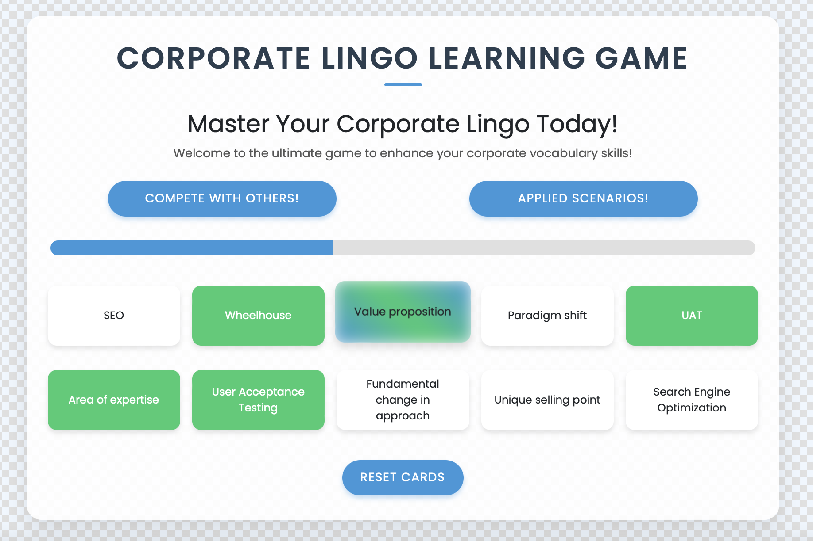

# Corpo-Lingo: Master Corporate Lingo

Learn Corporate Lingo to get Employed!!!

## Summary

Ever felt lost in a sea of corporate jargon? Fear not! This project will turn you into a corporate lingo master, ready to impress in any boardroom.

> Try out the online version of Corpo-Lingo at [www.corpo-lingo.glitch.me](https://www.corpo-lingo.glitch.me)!

## Features

1. **Learn Corporate Lingo:**
   Match words with their definitions to build your corporate vocabulary. This feature helps you understand and remember key terms used in the corporate world.



2. **Real-Time Competition:**
   Compete with other players in real-time to see who can match definitions the fastest. This adds a fun and competitive element to your learning process.


3. **Practice in Real-Life Scenarios:**
   Apply the words you've learned in simulated real-life corporate scenarios. This feature helps you practice and reinforce your new vocabulary in a practical context.


## How to Run

1. **Clone the repo:**

   ```sh
   git clone https://github.com/surpeme-gg-gg/corpo-lingo.git
   cd corpo-lingo
   ```

2. **Install dependencies:**

   ```sh
   npm install
   ```

3. **Set up the environment:**
   > You may skip this step if you are not planning to use the Practical Scenarios feature.
   - Get an API key from [Google AI Studio](https://makersuite.google.com/app/apikey).
   - Create a `.env` file in the root directory of the project.
   - In the `.env` file, add the following line, replacing `YOUR_API_KEY` with the key you obtained:
     ```
     GOOGLE_API_KEY=YOUR_API_KEY
     ```

4. **Run the app:**
   ```sh
   node server.js
   ```

> Get ready to buzzword your way to the top!